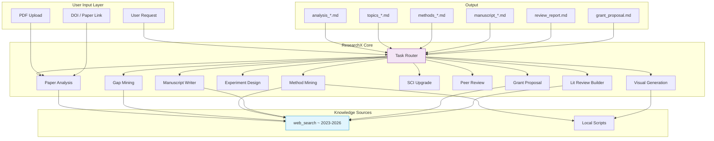
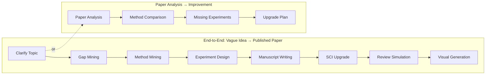
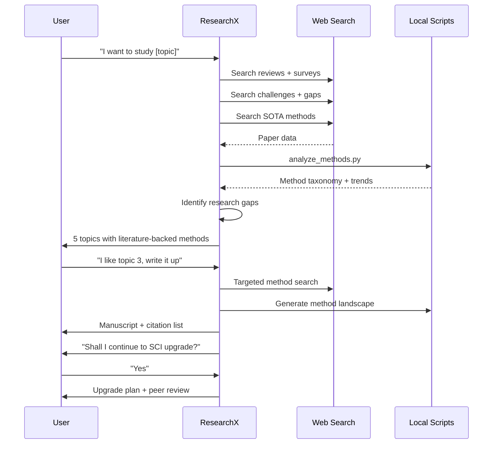

# 🔬 ResearchX — AI Research Operating System

> **The world's first literature-driven AI research assistant. Methods come from real papers, not hardcoded templates.**

[](https://github.com/xingguangYan/ResearchX)
[](https://github.com/features/codex)
[]()

---

## 📋 Table of Contents

- [Why ResearchX?](#-why-researchx)
- [Architecture Overview](#-architecture-overview)
- [Core Innovation: Literature-Driven Methods](#-core-innovation-literature-driven-methods)
- [Modules Deep Dive](#-modules-deep-dive)
- [Workflow Examples](#-workflow-examples)
- [Quick Start](#-quick-start)
- [Installation](#-installation)
- [Output Artifacts](#-output-artifacts)
- [FAQ](#-faq)
- [Contributing](#-contributing)

---

## 🎯 Why ResearchX?

### The Problem with Existing AI Research Tools

| Tool | Limitation |
|------|-----------|
| **ChatGPT / GPT-4** | Uses pre-training cutoff knowledge, can't find latest methods |
| **Paper chatbots** | Only summarize, don't help you design new research |
| **Research Copilots** | Hardcode methods ("use Transformer"), not grounded in current literature |
| **Literature tools** | Find papers but can't synthesize into actionable research plans |

### What ResearchX Does Differently

```
Other tools:    "For image segmentation, use U-Net or Transformer."
                     ↑ Pre-defined, may be outdated

ResearchX:      "For crop mapping from satellite imagery (2025),
                 the SOTA methods found via literature search are:
                 - SwinUNet (94.2% OA, 2024)
                 - SSTFormer (95.1% F1, 2025)
                 - GeoFM (emerging foundation model, 2025)
                 The gap is: none of these handle cloud-heavy regions well.
                 Innovation opportunity: [cross-domain idea]"
                     ↑ Grounded in real 2023-2026 literature
```

### Target Users

- **PhD students & researchers** — From literature review to paper submission
- **Masters students** — Thesis topic discovery and experimental design
- **Professors & PIs** — Grant proposals and research planning
- **Industry R&D** — Method selection and innovation discovery

---

## 🏗 Architecture Overview

### System Architecture



### Module Chaining (Auto-Integration)



### Literature-Driven Methodology Flow



---

## 💡 Core Innovation: Literature-Driven Methods

This is the single most important design decision in ResearchX.

### How It Works

```text
User says: "I want to study crop mapping using deep learning"

STEP 1 — web_search: "crop mapping deep learning review 2024 2025"
  → Finds: 2024 survey in RSE, 2025 benchmark paper

STEP 2 — web_search: "crop mapping challenge limitation"
  → Finds: Cloud cover problem, limited generalization, label scarcity

STEP 3 — web_search: "crop mapping state-of-the-art 2025"
  → Finds: SSTFormer, CropFormer, GeoFM foundation model

STEP 4 — Method landscape built:
  | Method Family     | Best Performer  | Year | Limitation           |
  |-------------------|----------------|------|----------------------|
  | CNN-based         | DeepCropNet    | 2023 | Limited context      |
  | Transformer-based | SSTFormer      | 2025 | Heavy computation    |
  | Foundation Models | GeoFM          | 2025 | Data-hungry          |

STEP 5 — Gap + Innovation identified:
  "None of these methods handle heavy cloud cover. 
   Innovation: Combine SSTFormer's accuracy with a cloud-imputation module from meteorology literature."
                        ↑ Cross-domain transfer from meteorology
```

### Why This Matters

- **Always current** — Not limited to pre-training data
- **Always grounded** — Every claim cites a real paper
- **Cross-domain** — Can borrow methods from any adjacent field
- **Falsifiable** — User can check the cited papers

---

## 🧩 Modules Deep Dive

### 1. 📄 Paper Analysis Engine
**Input**: PDF / DOI / Paper title  
**Output**: `analysis_[Paper]_YYYYMMDD.md`

```markdown
- One-sentence summary
- Research logic chain (RQ → Data → Method → Results)
- Academic thought analysis (Why done? Why this approach?)
- Strengths & Weaknesses table
- Missing experiments detected
- Literature context (latest SOTA comparison)
- Improvement suggestions
```

### 2. 🔍 Research Gap Mining
**Input**: Research domain or topic  
**Output**: `topics_[Topic]_YYYYMMDD.md`

Produces a **gap taxonomy** (Solved / Unsolved / Controversial / Unexplored) and generates **5 concrete SCI topic proposals** with:
- Specific research question
- Innovation statement (citing concrete papers)
- Data requirements
- Literature-backed method recommendation
- Target journal & feasibility score

### 3. ⚙️ Method Mining
**Input**: Research topic  
**Output**: `methods_[Topic]_YYYYMMDD.md`

| Component | Description |
|-----------|-------------|
| Method Families | Extracted from literature, not assumed |
| Evolution Timeline | 2022 → 2023 → 2024 → 2025-2026 |
| Method Landscape Table | Performance, pros, cons (from papers) |
| Innovation Opportunity | What's missing? What can be transferred? |

### 4. 🧪 Experiment Design
**Input**: Proposed method  
**Output**: Full experimental protocol

Designs: Baseline comparison (3-5 SOTA), Ablation study, Parameter sensitivity, Generalization tests (×3), Robustness tests, Statistical significance.  
Then detects: "What experiments are missing that reviewers would ask for?"

### 5. ✍️ Manuscript Writing
**Input**: Research plan  
**Output**: `manuscript_[Topic]_YYYYMMDD.md`

Generates any section on demand with journal-adapted style:
| Section | Template |
|---------|----------|
| Abstract | Background(1s) → Problem(1s) → Method(2-3s) → Results(2s) → Implication(1s) |
| Introduction | Broad → Specific → Gap → Our work → Contributions |
| Methods | Data → Model → Implementation → Evaluation |
| Results | Overall → Ablation → Parameter → Generalization |
| Discussion | Findings → Comparison → Limitations → Future |

### 6. 📈 SCI Upgrade System
**Input**: Draft paper  
**Output**: Upgrade action plan

Scores 4 dimensions (Novelty, Experiments, Writing, Related Work) and produces a **ranked priority action list** with specific literature citations. Recommends target journals with predicted acceptance rates.

### 7. 📝 Peer Review Simulation
**Input**: Paper draft  
**Output**: `review_report.md` + response letter

Generates 3-5 major comments + 2-3 minor comments from a selected reviewer persona. Includes a **revision strategy** and a point-by-point **response letter**.

### 8. 🎨 Visual Generation
**Input**: Research topic  
**Output**: Prompts for GPT Image / Midjourney / Flux

Generates:
- Graphical abstract prompts (3 platforms, 3 journal styles)
- Research poster layouts (A0, A1, 9:16, conference)
- Mermaid workflow diagram code

### 9. 📚 Literature Review Builder
**Input**: Research topic  
**Output**: `literature_matrix_[Topic]_YYYYMMDD.md`

Builds a structured literature matrix table → generates a coherent "Related Work" section with thematic grouping and critical comparison.

### 10. 🏛 Grant Proposal Builder
**Input**: Research topic  
**Output**: `grant_proposal_[Topic]_YYYYMMDD.md`

Full proposal structure (NSFC-compatible and international) with literature-backed claims, scientific questions, technical route, innovation points, and expected outcomes.

---

## 🔄 Workflow Examples

### Example 1: PhD Student Starting a New Topic

```text
User: "I'm a PhD student in remote sensing. I want to study crop type mapping
      using deep learning, but I need a specific topic and method."

ResearchX auto-chains: Gap Mining → Method Mining → Experiment Design

1. Clarify: "What region? What crops? What data do you have access to?"
2. Search: "crop type mapping deep learning review 2024 2025"
          "crop mapping challenge limitation"
          "crop mapping state-of-the-art 2025"
3. Gap analysis: identifies "few-shot learning for rare crops" as an open problem
4. Propose 5 topics with literature-backed methods
5. User picks one: "Few-shot crop mapping using foundation models"
6. Search methods specifically for this topic
7. Design full experimental protocol
8. Save: topics_crop_mapping_20250610.md, methods_few_shot_crop_20250610.md
```

### Example 2: Upgrading a Q2 Paper to Q1

```text
User: "I have a draft paper on urban land use classification using ResNet.
      I want to publish in RSE (Q1). Help me upgrade it."

ResearchX auto-chains: Paper Analysis → Method Mining → SCI Upgrade

1. Analyze the paper, extract its logic chain
2. Search: "urban land use classification 2024 2025"
3. Compare: The paper uses ResNet-50, while SOTA now uses Vision Transformers
4. Identify: Missing experiments (cross-city generalization, ablation)
5. Generate upgrade plan:
   Priority 1: Replace backbone with Swin Transformer (cite 3 papers)
   Priority 2: Add cross-city generalization test
   Priority 3: Add ablation study for each module
   Priority 4: Update related work with 8 missing 2024 papers
6. Simulate a review from RSE reviewer perspective
7. Save: upgrade_plan_urban_land_use_20250610.md, review_report.md
```

### Example 3: Grant Proposal Writing

```text
User: "I need to write an NSFC grant on ecological monitoring with AI."

ResearchX auto-chains: Gap Mining → Method Mining → Grant Proposal

1. Search: "ecological monitoring deep learning 2024 2025" (English)
          "生态监测 深度学习 2024 2025" (Chinese)
2. Find current gaps: lack of multi-sensor fusion methods
3. Propose research focus
4. Search methods for the chosen focus
5. Generate full grant proposal with:
   - 立项依据 (Research Rationale) — literature cited
   - 科学问题 (Scientific Questions)
   - 技术路线 (Technical Route) — Mermaid diagram
   - 创新点 (Innovation Points) — compared to existing work
   - 预期成果 (Expected Outcomes)
6. Save: grant_ecological_monitoring_20250610.md
```

---

## 🚀 Quick Start

### In Codex CLI / Desktop App

Just mention any research-related need:

```text
# Analyze a paper
"Please analyze this paper for me: [paste DOI or upload PDF]"

# Find a research topic
"I need a research topic in [your domain]. Find me gaps and propose 5 topics."

# Find methods
"What methods should I use for [your problem]?"

# Write a paper
"Write the introduction and methods sections for a paper on [topic]."

# Upgrade to Q1
"I have a paper draft. Help me assess its quality and plan Q1 upgrades."

# Generate visuals
"Create a graphical abstract prompt for my paper on [topic]."
```

### Sample Output

Every module produces a structured markdown file. Example: `topics_crop_mapping_20250610.md`

```markdown
## Topic 3: Few-Shot Crop Mapping via Foundation Model Fine-Tuning

**Research Question**: Can a pre-trained foundation model (e.g., GeoFM) achieve
>90% crop classification accuracy with fewer than 50 labeled samples per class?

**Innovation**: First systematic evaluation of foundation model fine-tuning
strategies for crop mapping in data-scarce regions (cf. [Liu, 2024] which
requires 500+ samples).

**Data Needed**: Sentinel-2 imagery + Cropland Data Layer (CDL) labels

**Proposed Methods**: 
- Baseline: SSTFormer (SOTA at 95.1% with full data) [Chen, 2025]
- Proposed: GeoFM + LoRA fine-tuning [adapting from NLP, 2024]
- Also evaluate: Prompt-based learning [new, not yet applied to crops]

**Target Journal**: Remote Sensing of Environment, IF 13.5, Q1
**Feasibility**: ★★★★☆
```

---

## 📦 Installation

### Method 1: Direct Copy (Local)

```powershell
# From this repo
Copy-Item -Recurse "ResearchX" "$env:USERPROFILE\.codex\skills\ResearchX"
```

### Method 2: GitHub Clone

```powershell
git clone https://github.com/xingguangYan/ResearchX.git
Copy-Item -Recurse "ResearchX/ResearchX" "$env:USERPROFILE\.codex\skills\ResearchX"
```

### Method 3: Symlink (for development)

```powershell
# Windows (Admin PowerShell)
New-Item -ItemType Junction -Path "$env:USERPROFILE\.codex\skills\ResearchX" `
  -Target "C:\path\to\ResearchX\ResearchX"
```

### Verify Installation

```powershell
# Check the skill is recognized
Get-ChildItem "$env:USERPROFILE\.codex\skills\ResearchX"
# Should show: SKILL.md, agents/, scripts/, references/, assets/
```

---


## 🌐 Multi-Platform Support

ResearchX works across **all major AI agent platforms**:

| Platform | Config File | Installation | Auto-Discovery |
|----------|------------|-------------|----------------|
| Codex (OpenAI) | ResearchX/SKILL.md | `~/.codex/skills/ResearchX` | Trigger terms |
| Claude Code | platforms/CLAUDE.md | Copy to project root | Auto-reads CLAUDE.md |
| GitHub Copilot | AGENTS.md | Repo root | Auto-reads AGENTS.md |
| Cursor | platforms/.cursorrules | Copy to project root | Auto-reads .cursorrules |
| Cline / Roo Code | platforms/.clinerules | Copy to project root | Auto-reads .clinerules |
| Continue.dev | platforms/.continuerules | Copy to project root | Auto-reads .continuerules |
| Windsurf | platforms/.windsurfrules | Copy to project root | Auto-reads .windsurfrules |
| OpenAI GPTs | platforms/mcp.json | GPT Builder config | Manual |
| MCP Clients | platforms/mcp.json | MCP server config | Manual |

### Quick Install

```bash
git clone https://github.com/xingguangYan/ResearchX.git
cd ResearchX

# Codex (PowerShell):
Copy-Item -Recurse "ResearchX" "$env:USERPROFILE\.codex\skills\ResearchX"

# Claude/Cursor/Cline/Continue/Windsurf (Bash):
cp platforms/CLAUDE.md ./CLAUDE.md
cp platforms/.cursorrules ./.cursorrules
cp platforms/.clinerules ./.clinerules
cp platforms/.continuerules ./.continuerules
cp platforms/.windsurfrules ./.windsurfrules
```

For full instructions, see [ResearchX/platforms/PLATFORMS.md](ResearchX/platforms/PLATFORMS.md).

---

## 📂 Output Artifacts

Each module saves structured files to the working directory:

| File Pattern | Module | Contains |
|-------------|--------|----------|
| `analysis_[Paper].md` | §1 Paper Analysis | Full paper breakdown |
| `topics_[Topic]_*.md` | §2 Gap Mining | 5 topic proposals |
| `methods_[Topic]_*.md` | §3 Method Mining | Method landscape |
| `manuscript_[Topic]_*.md` | §5 Manuscript Writing | Full paper draft |
| `upgrade_plan_[Paper]_*.md` | §6 SCI Upgrade | Action plan |
| `review_report.md` | §7 Peer Review | Review + response |
| `grant_proposal_[Topic]_*.md` | §10 Grant Proposal | Full proposal |
| `literature_matrix_[Topic]_*.md` | §9 Lit Review | Matrix + related work |

---

## ❓ FAQ

### Q: Does ResearchX work for my field?
**A**: Yes. ResearchX is domain-agnostic. It searches literature for ANY scientific topic. The method mining protocol is the same whether you study remote sensing, medicine, materials science, or ecology.

### Q: What if web_search returns no results?
**A**: ResearchX detects this and falls back to first-principles reasoning, clearly stating the limitation. It will ask you to verify assumptions.

### Q: Can I use it without Python?
**A**: Yes. The Python scripts are helper tools for analysis. The core SKILL.md works with `web_search` alone. The scripts provide deeper analysis (method taxonomy, trend scoring).

### Q: How is this different from just using ChatGPT?
**A**: ChatGPT relies on its pre-training knowledge cutoff. ResearchX actively searches for the LATEST papers (2023-2026) and builds method landscapes from real literature. It also chains multiple research workflows together automatically.

### Q: Is it only for SCI papers?
**A**: No. While the writing templates target SCI journals, the gap mining, method discovery, and experiment design modules work for ANY research output (conference papers, theses, technical reports).

### Q: Can it read my PDF?
**A**: If you upload a PDF in Codex, ResearchX will analyze it using the Paper Analysis Engine. It extracts metadata, logic chain, and compares with latest literature.

### Q: How do I update the skill?
**A**: Pull the latest from this repo and copy the folder again:
```powershell
git pull
Copy-Item -Recurse "ResearchX" "$env:USERPROFILE\.codex\skills\ResearchX"
```

---

## 🤝 Contributing

ResearchX aims to be the world's best AI research tool. Contributions are welcome!

### Ideas for Contribution

- **New module**: Data visualization, statistical analysis, code generation
- **Writing templates**: More journal styles (ACM, IEEE, Nature family)
- **Domain-specific protocols**: Medicine (clinical trial design), Chemistry (lab protocols)
- **Scripts**: Citation analysis, network graphs, topic modeling
- **Translations**: Multi-language support for non-English researchers

### How to Contribute

1. Fork the repository
2. Create a feature branch
3. Make your changes
4. Submit a pull request

---

## 📄 License

MIT License — free to use, modify, and distribute.  
Built for the global research community.

---

*ResearchX — Moving research assistance from "what I know" to "what the field knows."*
