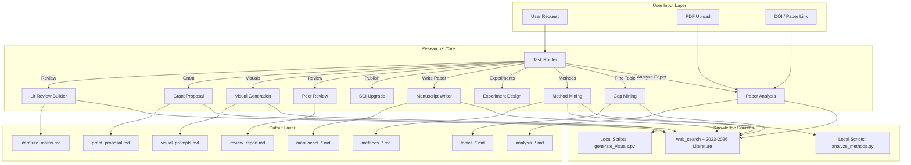
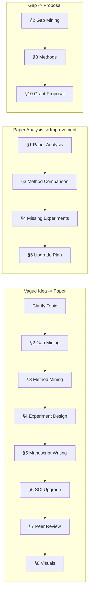
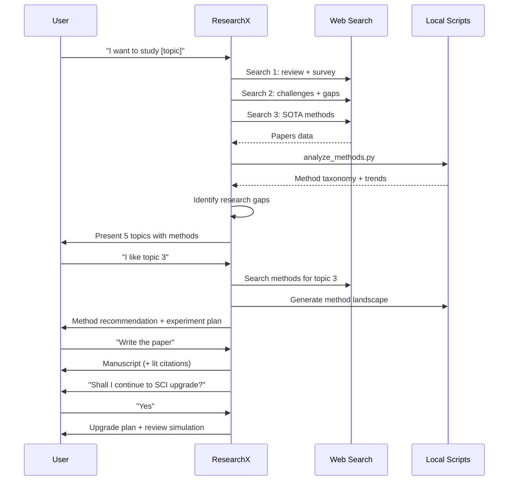

# ResearchX Architecture Diagram

This directory contains architecture and workflow diagrams for ResearchX.

## System Architecture

## Module Chaining Logic

## Literature-Driven Methodology Flow

