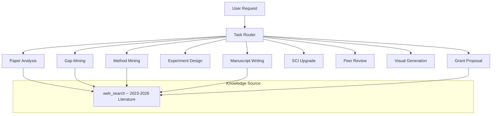

# ResearchX — Multi-Platform Support

ResearchX is designed to work across ALL major AI agent platforms. Below are installation instructions for each platform.

---

## Quick Comparison

| Platform | Config File | Installation | Auto-Discovery |
|----------|------------|--------------|----------------|
| **Codex (OpenAI)** | `ResearchX/SKILL.md` | Copy to `~/.codex/skills/` | ✅ Trigger terms |
| **Claude Code (Anthropic)** | `CLAUDE.md` | Copy to project root | ✅ Auto-reads CLAUDE.md |
| **GitHub Copilot** | `AGENTS.md` | Already in repo root | ✅ Auto-reads AGENTS.md |
| **Cursor** | `.cursorrules` | Copy to project root | ✅ Auto-reads .cursorrules |
| **Cline / Roo Code** | `.clinerules` | Copy to project root | ✅ Auto-reads .clinerules |
| **Continue.dev** | `.continuerules` | Copy to project root | ✅ Auto-reads .continuerules |
| **Windsurf** | `.windsurfrules` | Copy to project root | ✅ Auto-reads .windsurfrules |
| **OpenAI GPTs** | `openapi.yaml` | Upload as GPT Action | Requires manual config |
| **MCP Clients** | `mcp.json` | Add to MCP config | Requires manual config |

---

## 1. Codex (OpenAI)

```powershell
# Install from this repo
Copy-Item -Recurse "ResearchX" "$env:USERPROFILE\.codex\skills\ResearchX"
```

ResearchX is already in the Codex skill format with `SKILL.md` frontmatter. It auto-triggers on research-related terms.

## 2. Claude Code (Anthropic)

Claude Code auto-reads `CLAUDE.md` from the project root.

```bash
# Install: Copy CLAUDE.md to your project root
cp platforms/CLAUDE.md ./CLAUDE.md

# Or link it
ln -s platforms/CLAUDE.md CLAUDE.md
```

Then Claude Code will automatically know how to act as ResearchX when you ask research-related questions.

## 3. Cursor

Cursor auto-reads `.cursorrules` from the project root.

```bash
# Install
cp platforms/.cursorrules ./.cursorrules
```

## 4. Cline / Roo Code

Cline and Roo Code auto-read `.clinerules` from the project root.

```bash
# Install
cp platforms/.clinerules ./.clinerules
```

## 5. Continue.dev

Continue.dev auto-reads `.continuerules` from the project root.

```bash
# Install
cp platforms/.continuerules ./.continuerules
```

Or add to your Continue config.json:

```json
{
  "rules": [{
    "title": "ResearchX",
    "file": ".continuerules"
  }]
}
```

## 6. Windsurf

Windsurf auto-reads `.windsurfrules` from the project root.

```bash
# Install
cp platforms/.windsurfrules ./.windsurfrules
```

## 7. OpenAI GPTs

1. Create a new GPT at https://chat.openai.com/gpts
2. In "Instructions", paste the content of `platforms/CLAUDE.md`
3. Enable "Web Browsing" capability (for literature search)
4. Upload the Knowledge files from `ResearchX/references/`
5. Save your GPT

## 8. MCP (Model Context Protocol) Clients

For any MCP-compatible client (Claude Desktop, Cline MCP, etc.):

Add to your MCP configuration:

```json
{
  "mcpServers": {
    "researchx": {
      "type": "local",
      "command": "cat",
      "args": ["path/to/platforms/mcp.json"]
    }
  }
}
```

---

## Auto-Discovery via GitHub

When you clone this repository, several config files are auto-discovered:

| File | Discovered By |
|------|---------------|
| `AGENTS.md` | GitHub Copilot, Codex, Cline |
| `README.md` | Everyone (manual) |
| `ResearchX/SKILL.md` | Codex (if installed to skills dir) |

For platforms that require root-level config files (`.cursorrules`, `.clinerules`, etc.), 
copy them from `platforms/` to your project root as shown above.

---

## Keeping In Sync

When ResearchX is updated on GitHub, update your local configs:

```bash
# For project-level configs
git pull

# For Codex skill
Copy-Item -Recurse "ResearchX" "$env:USERPROFILE\.codex\skills\ResearchX"

# For platform configs (Cursor, Cline, etc.)
cp platforms/.cursorrules .cursorrules
cp platforms/.clinerules .clinerules
# ... etc
```

---

## Architecture Overview (Platform-Independent)



---

*ResearchX — Literature-driven research assistance for any AI platform.*
