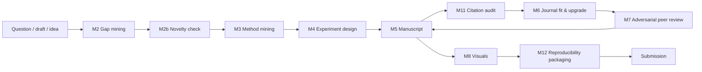
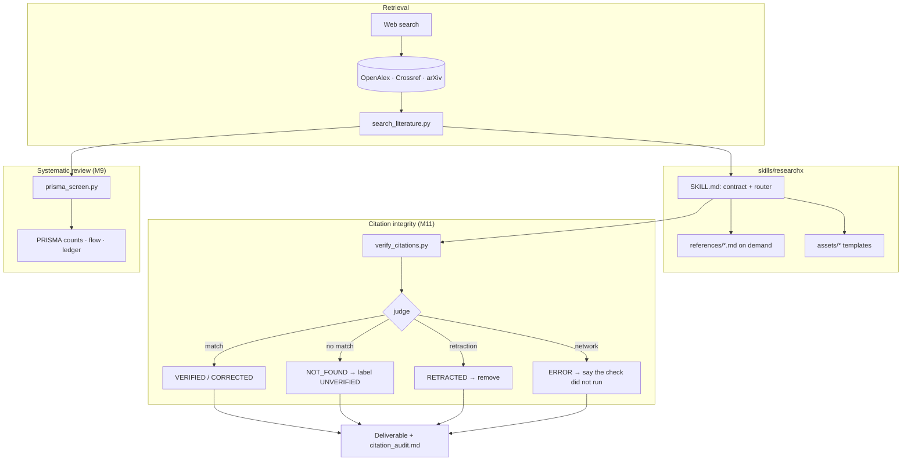
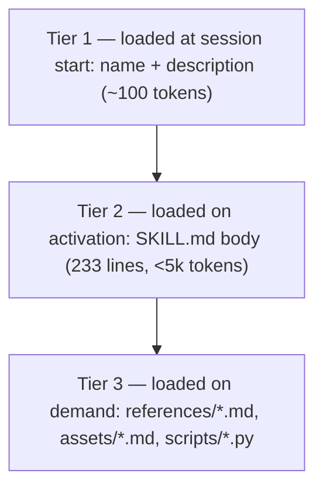
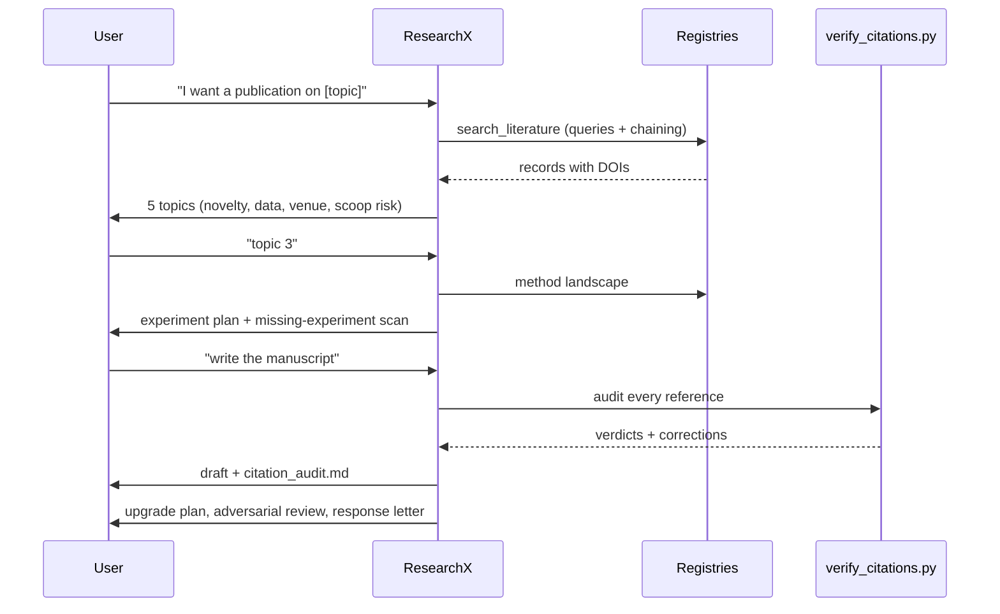
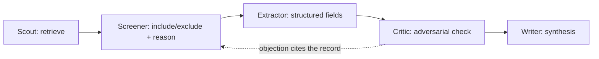

# Architecture diagrams

Copy-paste Mermaid for docs, slides and proposals. Keep them in sync with `SKILL.md` if you change the
module list.

## 1. The lifecycle loop

## 2. Where the guarantees come from

## 3. Progressive disclosure (context budget)

## 4. Module chaining for a full paper

## 5. Multi-agent pattern (platforms with subagents)

Each agent returns artifacts, not prose summaries; the Critic must name the record it objects to.
