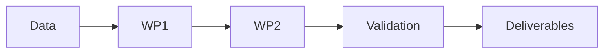

# Grant Proposal: [Title]

**Funder / programme**: [NSFC 面上/青年, EU Horizon, NSF, ...] | **Budget**: ... | **Duration**: ...
**Applicant(s)**: ... | **Date**: YYYY-MM-DD

## 立项依据 / Rationale
1. Field state (cited, 2023-2026 literature)
2. The specific unsolved problem — with the evidence that it is unsolved
3. Why now (new data, new method, new policy need)
4. Why this team / this setting

## 科学问题 / Scientific questions
- Q1: [falsifiable question]
- Q2: [falsifiable question]

## 研究目标 / Objectives
| # | Objective | Measurable outcome | Deadline |
|---|---|---|---|

## 研究内容 / Work packages
### WP1 — [name]
Inputs / method / outputs / milestones / risks

## 技术路线 / Technical route

Critical path: ... | Decision gates: ...

## 创新点 / Innovation
1. **[Innovation]** — versus [closest work, cited]: ...
2. ...

## Feasibility
Preliminary results: ... | Data access: ... | Facilities: ... | Team: ...

## Risk mitigation
| Risk | Likelihood | Impact | Mitigation |
|---|---|---|---|

## 预期成果 / Expected outcomes
Publications: ... | Data/code: ... | Talent: ... | Impact: ...

## Timeline & budget
| Phase | Months | Milestone | Budget |
|---|---|---|---|

## References
[All verified via `verify_citations.py` — see `citation_audit_YYYYMMDD.md`]
