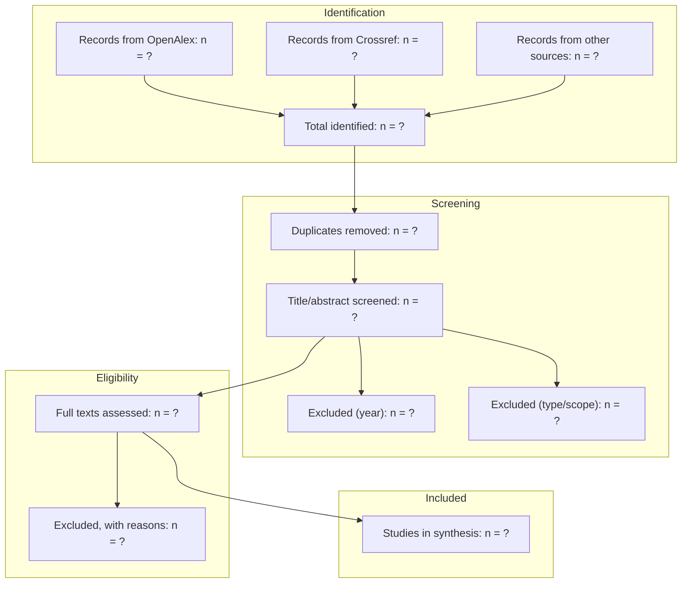

# PRISMA 2020 Flow (template)

Generated by `python skills/researchx/scripts/prisma_screen.py --input hits.json --out-prefix review1`
— this file shows the shape; the script fills in real counts and writes `review1_flow.md`.

## Search record (must be filled for a defensible review)
| Field | Value |
|---|---|
| Registries | ... |
| Query strings | `...` |
| Date of last search | YYYY-MM-DD |
| Filters | from-year, language, type |
| Screening | who, how many screeners, disagreement rule |
| Registration | PROSPERO/OSF ID or "not registered" |
| AI assistance | stages, tool, verification (PRISMA-trAIce) |
| Deviations from protocol | ... |
